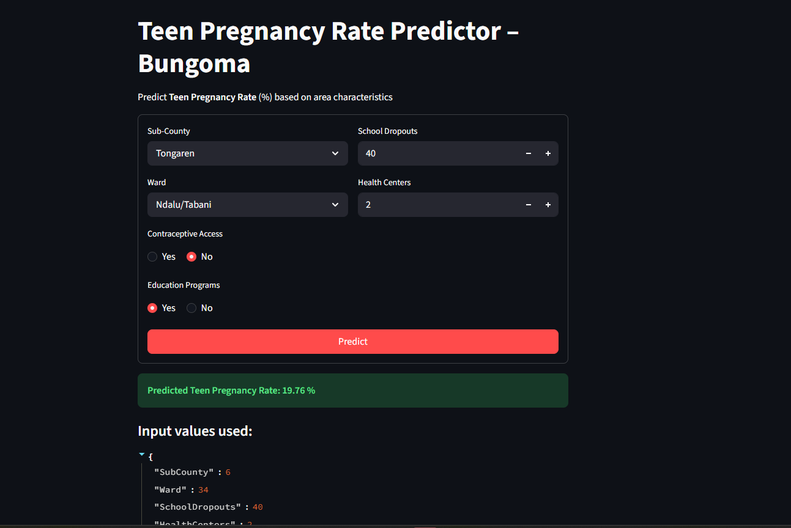

# Teenage Pregnancy Rate Predictor – Bungoma County

[](https://www.kaggle.com/datasets/joelmulongo/teenage-pregnancy-bungoma-county2025)


**Interactive web application** that predicts **teen pregnancy rates** (%) in different wards and sub-counties of Bungoma County, Kenya, using a trained **Random Forest** regression model.

Built with **Streamlit** for an easy-to-use interface and trained on local socio-economic and health data.

## ✨ Demo



## Features

- Predict teen pregnancy rate based on:
  - Sub-County
  - Ward
  - Number of school dropouts
  - Number of health centers
  - Access to contraceptives (Yes/No)
  - Presence of education programs (Yes/No)
- Clean and intuitive Streamlit dashboard
- Model trained with scikit-learn RandomForestRegressor
- Label encoding for categorical variables
- Quick training script included (`train.py`)

# Setup Instructions

## Prerequisites

- Python **3.11 or 3.12** recommended (scikit-learn and other ML libraries have the most stable, pre-built support on these versions — newer versions like 3.13/3.14 may fail to install some packages)
- `pip` (comes bundled with Python)

Check your installed Python versions (Windows):
```bash
py -0
```

## 1. Clone the repository

```bash
git clone <your-repo-url>
cd teenage-pg
```

## 2. Create and activate a virtual environment

Using a virtual environment keeps this project's dependencies isolated from other Python projects on your machine.

**Windows:**
```bash
py -3.12 -m venv venv
venv\Scripts\activate
```

**macOS / Linux:**
```bash
python3.12 -m venv venv
source venv/bin/activate
```

You'll know it worked when you see `(venv)` at the start of your terminal prompt.

## 3. Install dependencies

```bash
pip install -r requirements.txt
```

If `requirements.txt` isn't present yet, install the packages directly:

```bash
pip install streamlit pandas numpy scikit-learn joblib
```

Then generate a `requirements.txt` for future use:

```bash
pip freeze > requirements.txt
```

## 4. Train the model

The trained model files (`.pkl`) are **not included in this repository** (see `.gitignore`) since they're large binary files. You must generate them locally before running the app:

```bash
python train.py
```

This reads `bungoma.csv`, trains a `RandomForestRegressor`, and saves:
- `teenage-pg-rf-model.pkl`
- `teenage-pg-encoders.pkl`

into the project folder. You only need to do this once — or again if you update `bungoma.csv` or retrain the model.

## 5. Run the app

```bash
python -m streamlit run app.py
```

Streamlit will start a local server and print a URL, typically:
```
Local URL: http://localhost:8501
```

Open that link in your browser to use the app.

## Troubleshooting

| Error | Cause | Fix |
|---|---|---|
| `ModuleNotFoundError: No module named 'X'` | Missing dependency | `pip install X` |
| `FileNotFoundError: teenage-pg-rf-model.pkl` | Model not trained yet | Run `python train.py` first |
| `pip install scikit-learn` fails | Python version too new for available wheels | Use Python 3.11 or 3.12 instead |

